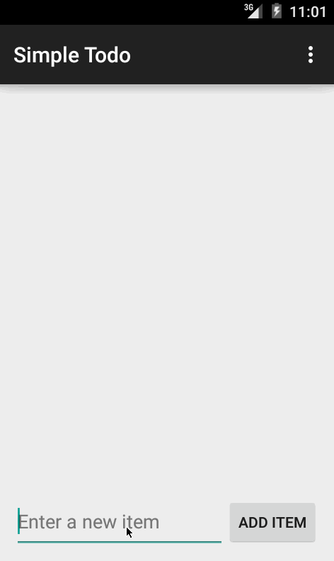

# My Todo app for CodePath

This is an Android app for adding, updating and removing items on your "ToDo" list.

Time spent: About 3 hours so far

Completed user stories:

 * [x] Required: Created ToDo App
 * [x] Required: Added Edit feature.
 
Notes:

Not sure if I'm persisting correctly as I've not used the hint "saveItems" on the last step. I'm going to start working on "Extras" next.

Below gif displays the required user stories:

GIF was created with [LiceCap](http://www.cockos.com/licecap/).
